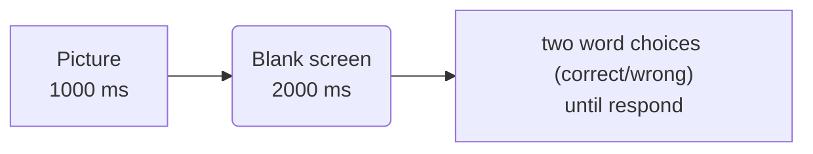

# Word/Non-word recognition test
A small dyslexia case-based experiment made with psychopy

The patient we used as a case study had a reading problem, in which the patient described the word/letter as "blended" while listening and talking, which is still intact.

According to McClelland and Rumelhart's model of letter-to-word recognition,  a patient may have an abnormality at the letter-to-word recognition neural node.

_The aforementioned model, consisting of layers for letter feature, letter, and word recognition_

The task objective is to see whether the patient can differentiate a real word from a misspelled word, measured in accuracy $\frac{\text{correct trials}}{all trials}$ and time reaction $t(s)$

A list of words and images used are based on [BOSS (the Bank Of
Standardized Stimuli)](https://drive.google.com/folderview?id=0B3m1Sf0USgt8bXRjZFNDMUwzaWc&usp=sharing)

The two-word choices can be classified into 3 pairs: correct and incorrect variants.
- __correct - greek__, replace some letter(s) with a different but similar visual one, including but not limited to Greek letter (we call it __greek__ since it's more intuitive and many are familiar with it)
- __correct - scramble__, self-explanatory, randomize the letter position
- __correct - pseudo__, change all except the fist letter into a *pseudoword* that pronounceable but have no real meaning. The dataset can be found [here](https://doi.org/10.3389/fpsyg.2015.01395)

The result can be interpreted in the following table by each hypothesis. The arrow represents how the accuracy would be if each hypothesis is true when the subject is tested with different word pairs.

| proposed condition\accuracy               | greek | scramble      | pseudo |
| ---------------------------------------------------- | -------------- | ------------ | ---------------------- |
| *example: Dog*                                            | Ꟈog    | goD  | Dod         |
| guessing the word from the word's shape | $\downarrow$   | $\uparrow$   | $\updownarrow$                    |
| use letter to recognize word                         | $\uparrow$     | $\downarrow$ | $\uparrow$             |
| can access lexicon (know what word means)            | $\uparrow$     | $\uparrow$   | $\updownarrow$                    |

The word lengths will range from 3 to 7 letters, with 20 words for each length, totaling 100 words. Each word has 3 incorrect variations including Greek, scramble, and pseudoword (4 in total), 300 trials overall. 

| id | len | correct | greek | scramble | pseudo |
| ---- | ----- | ----- | ------| -------| ------ |
|1 | 3 | Dog |Ꟈog | goD | Dod |
|2| 3 | Cat | Cαt | taC | Cot |
|...|...|...|...|...|...|
|100 | 7 | Hamster | Hαmstεr | Tmshrea |Hamotor|

tTheexpected outcomes are formatted in two `.csv` files (accuracy ratio and reaction time)

`Accuracy.csv` _will look like this_
| id | len  | greek | scramble | pseudo |
| ---- |  ----- | ------| -------| ------ |
|1 | 3 | 1 | 0 | 1 |
|2| 3 |  1 | 1 | 1 |
|...|...|...|...|...|
|100 | 7 | 0 | 0 |0|
