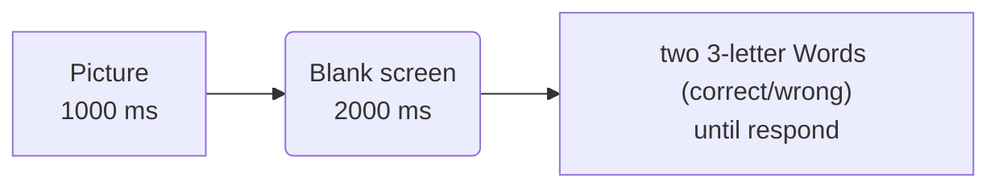

# Word/Non-word recognition test
A small dyslexia case-based experiment made with psychopy

The patient that we used as a case study has a  reading problem in which the patient described the word/letter as "blended together" while listening and talking are still intact.

According to McClelland and Rumelhart's model of letter-to-word recognition  a patient may have abnormality at letter-to-word recognition nerual node

The task objective is to see whether the patient can differentiate a real word from a mispell word, measured in accuracy and decision duration

